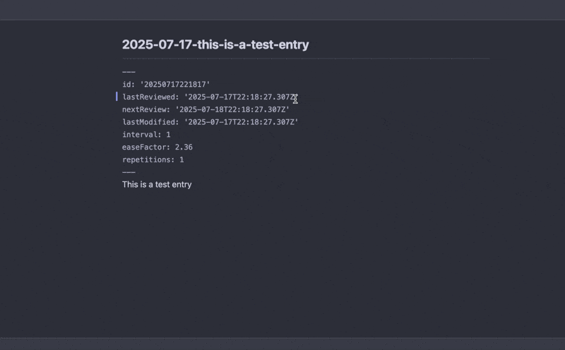

# Spaced Repetition Writing Inbox

Use spaced reptition to help you write! Inspired by [Andy Matuschak](https://notes.andymatuschak.org/zSK4LyrCbG9zDrdCWmcovUW).

Create notes and thoughts that are added to a writing inbox. Review these notes daily marking them as fruitful or unfruitful. Fruitful posts you'll see more often and unfruitful ones you'll see less.
Once you no longer need a post you can archive it so it no longer appears in your review queue.



## Commands
**Writing Inbox: Add New Entry**
Creates a new file under your writing inbox folder. Queues it up for daily review.

**Writing Inbox: Start Daily Review**
Start a review of notes and thoughts you've added over time. Uses spaced repetition to determine what notes should be reviewed today.

**Writing Inbox: Stop Daily Review**
Stop reviewing notes for today.

## Settings
| Setting | Description |
| ------- | ----------- |
| Writing Inbox Folder | The folder where your writing entries will be stored. Defaults to `writing-inbox/` |
| Daily Entry Limit | Max number of entries to review per day.|

The writing inbox folder structure looks like so:

```
writing-inbox/
  archive/
    2025-01-01-archived-post.md
  entries/
    2025-01-01-post-one.md
    2025-01-01-post-two.md
```

## Donate
[](https://ko-fi.com/V7V51ID74I)